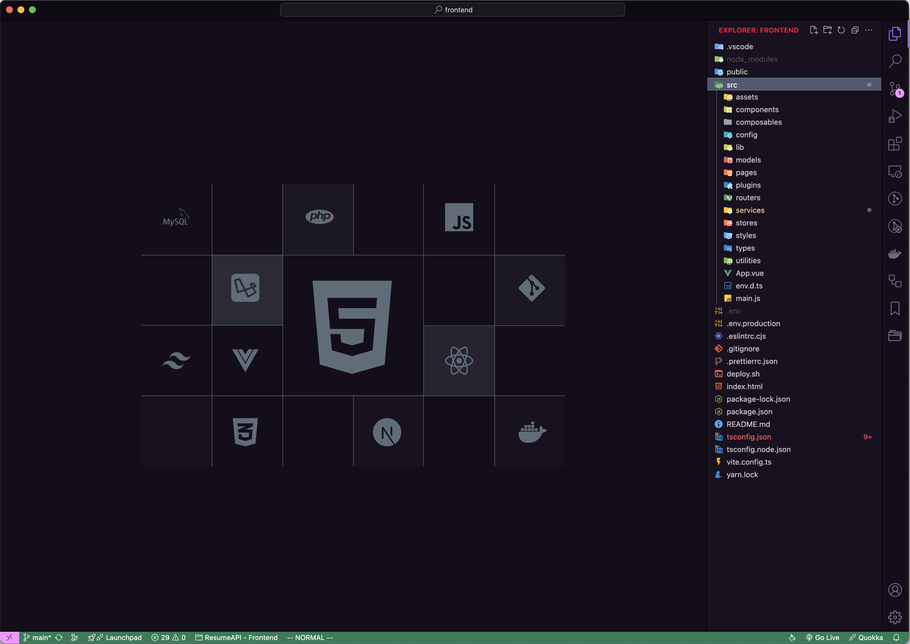
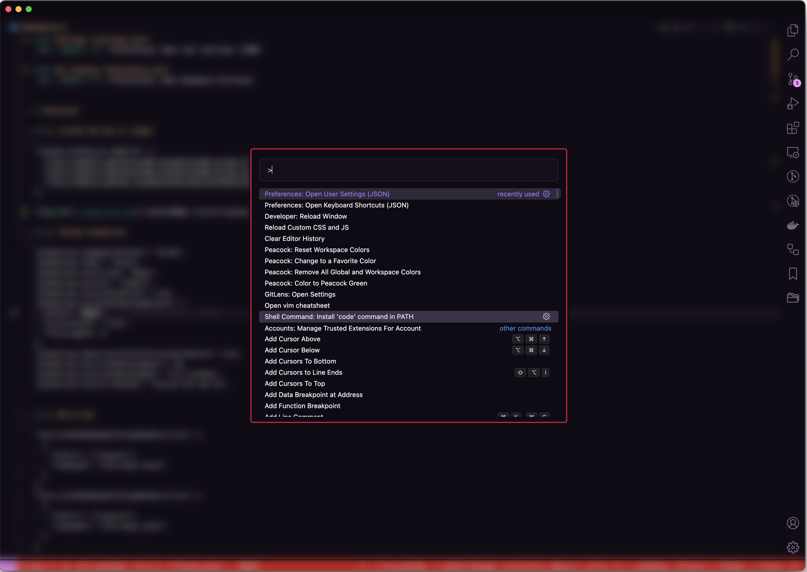

# Cài đặt VSCode


| Settings ||
|-------|-------|
| Theme | "Aura Dracula Spirit" |
| Icon | "material-icon-theme" |


#### Settings (settings.json)
`Ctr + Shift + P`: Preferences: Open user settings (JSON)

#### Key binding (keybinding.json)
`Ctr + Shift + P`: Preferences: Open Keyboard Shortcuts


# Extension

## 1. Custom CSS and Js loader
```
"vscode_custom_css.imports": [
  "file:///Users/_david/vscode-custom/vscode-script.js",
  "file:///Users/_david/vscode-custom/vscode-styles.css",
  "file:///Users/_david/.vscode/extensions/brandonkirbyson.vscode-animations-2.0.7/dist/updateHandler.js"
],
```
{ width=800px style="display: block; margin: auto; max-width: 100%" }

## 2. VSCode Animations
```
"animations.Command-Palette": "Slide",
"animations.Tabs": "Scale",
"animations.Scrolling": "None",
"animations.Active": "Indent",
"animations.CursorAnimation": true,
"animations.CursorAnimationOptions": {
  "Color": "#333",
  "CursorStyle": "line",
  "TrailLength": 8
},
"animations.UseCursorColorForCursorAnimation": true,
"animations.Focus-Dimming-Amount": 70,
"animations.Focus-Dimming-Mode": "Full Window",
"animations.Install-Method": "Custom CSS and JS",
```

## 3. Whick Key
Setting dùng với VSCode VIM extension
```
"vim.normalModeKeyBindingsNonRecursive": [
  {
    "before": ["<space>"],
    "commands": ["whichkey.show"]
  }
],
"vim.visualModeKeyBindingsNonRecursive": [
  {
    "before": ["<space>"],
    "commands": ["whichkey.show"]
  }
]
```
{ width=800px style="display: block; margin: auto; max-width: 100%" }
